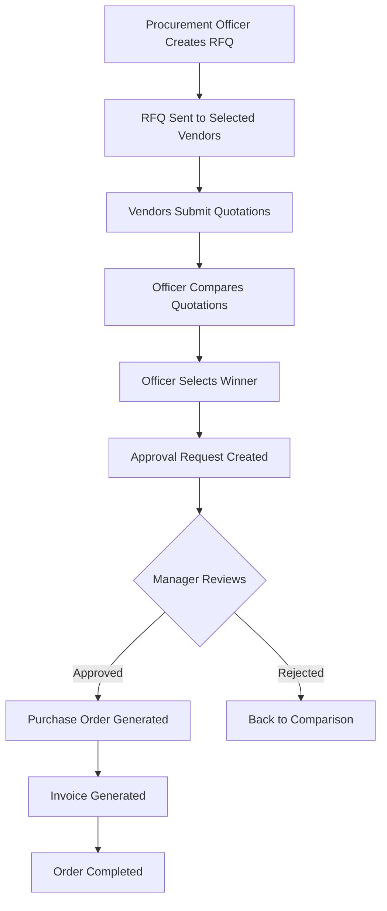

# 🛒 VendorBridge - Procurement Management System

> **Live Demo:** [https://vendorbridge-lilac.vercel.app/](https://vendorbridge-lilac.vercel.app/)

A comprehensive, full-stack procurement management system that streamlines the entire procurement lifecycle from vendor management to purchase order generation. Built with modern web technologies for optimal performance and user experience.


---

## 📋 Table of Contents

- [Overview](#-overview)
- [Live Demo](#-live-demo)
- [Key Features](#-key-features)
- [Tech Stack](#-tech-stack)
- [Complete Workflow Guide](#-complete-workflow-guide)
- [User Roles Explained](#-user-roles-explained)
- [Getting Started](#-getting-started)
- [Installation Guide](#-installation-guide)
- [Database Setup](#-database-setup)
- [Environment Configuration](#-environment-configuration)
- [Deployment](#-deployment)
- [Usage Guide](#-usage-guide)
- [Troubleshooting](#-troubleshooting)
- [API Documentation](#-api-documentation)
- [Contributing](#-contributing)
- [License](#-license)

---

## 🌟 Overview

VendorBridge is a sophisticated procurement management platform designed to modernize and automate the procurement process for organizations of any size. The system eliminates manual paperwork, reduces procurement cycle time, and provides complete visibility into the procurement pipeline.

### Why VendorBridge?

- ⚡ **Faster Procurement**: Reduce procurement cycle time by up to 60%
- 📊 **Complete Visibility**: Track every stage of procurement with real-time updates
- 💰 **Cost Savings**: Compare multiple quotes side-by-side to get the best deals
- 🔒 **Secure & Compliant**: Role-based access control with complete audit trails
- 📈 **Data-Driven Insights**: Comprehensive analytics and reporting
- 🌐 **Cloud-Based**: Access from anywhere, anytime

---

## 🚀 Live Demo

**Production URL:** [https://vendorbridge-lilac.vercel.app/](https://vendorbridge-lilac.vercel.app/)

### Test Accounts

You can test the system with these demo accounts:

| Role | Email | Password | Access |
|------|-------|----------|--------|
| Procurement Officer | officer@test.com | test123 | Create RFQs, Compare Quotes |
| Vendor | vendor@test.com | test123 | View RFQs, Submit Quotes |
| Manager/Approver | manager@test.com | test123 | Review & Approve Requests |

> **Note:** Demo accounts may be reset periodically. Feel free to create your own test account!

---

## ✨ Key Features

### 🔐 Authentication & Security
- **Secure Authentication** with email/password
- **Password Reset** with email verification
- **Role-Based Access Control (RBAC)** for 4 user types
- **Session Management** with automatic logout
- **Profile Management** with organization details
- **Audit Trails** for all user actions

### � Vendor Management
- **Complete Vendor Database**
  - Add, edit, and delete vendor profiles
  - Track vendor ratings (0-5 stars)
  - Monitor total orders per vendor
  - Categorize by industry/service type
  - Active/inactive status management
  - Optional vendor-user account linking

- **Vendor Categories**
  - IT & Hardware
  - Office Supplies
  - Services
  - Maintenance
  - General

- **Vendor Performance Tracking**
  - Historical order data
  - Delivery time analysis
  - Quality ratings
  - Total spend per vendor

### 📝 RFQ (Request for Quotation) System
- **Create Detailed RFQs**
  - Multiple line items with specifications
  - Quantity, unit, and product details
  - Priority levels (Low, Medium, High, Urgent)
  - Deadline management
  - Rich text descriptions
  
- **Smart Vendor Selection**
  - Select multiple vendors per RFQ
  - Category-based vendor filtering
  - Vendor availability status
  
- **RFQ Status Tracking**
  - Pending: Awaiting vendor responses
  - In Review: Comparing submitted quotes
  - Approved: Winner selected and approved
  - Rejected: Request declined
  - Completed: Order fulfilled

### 💼 Quotation Management
- **Vendor Quote Submission**
  - View all available RFQs in real-time
  - Item-by-item pricing breakdown
  - Delivery timeline specification
  - Quotation validity period
  - Additional terms and notes
  - Automatic total calculations
  - Duplicate submission prevention

- **Intelligent Comparison**
  - Side-by-side quote comparison
  - Automatic highlighting of:
    - 🏆 Best price (lowest total)
    - ⚡ Fastest delivery
    - ⭐ Highest rated vendor
  - Detailed item-level breakdown
  - Vendor rating display
  - Sort and filter options

### ✅ Approval Workflow
- **Multi-Stage Approval Process**
  - Manager/Approver review system
  - Visual timeline of approval stages:
    1. RFQ Created
    2. Quotation Selected
    3. Approval Review (Current)
    4. PO Generation
  
- **Approval Actions**
  - Review complete quotation details
  - Add approval remarks/comments
  - Approve or reject with reasons
  - Automatic PO generation on approval
  - Email notifications (configurable)

- **Status Management**
  - Pending approvals list
  - Approved requests archive
  - Rejected requests with reasons
  - Complete audit trail

### 📊 Purchase Orders & Invoicing
- **Automated PO Generation**
  - Auto-create POs from approved quotations
  - Unique PO numbers
  - Complete vendor and item details
  - Tax calculations (15% default)
  - Subtotal and grand total
  
- **PO Status Tracking**
  - In Progress: Order being fulfilled
  - Completed: Order received
  - Cancelled: Order cancelled

- **Professional Invoices**
  - Generate invoices from POs
  - Company branding and logo
  - Line item details with pricing
  - Tax breakdown
  - Payment terms
  - **Export Options:**
    - 📄 Download as PDF
    - 🖨️ Print directly
    - 📧 Email to vendor
  - Clean, professional formatting

### 📈 Reports & Analytics
- **Dashboard Metrics**
  - 💰 Total Spend (Year-to-Date)
  - 👥 Active Vendors Count
  - 📦 Total Orders
  - 📊 Average Order Value

- **Interactive Charts**
  - 📉 Monthly Procurement Trends (Line Chart)
    - Spending over time
    - Order volume trends
  - 🥧 Category Distribution (Pie Chart)
    - Spending by category
    - Percentage breakdown
  - 📊 Category Spending (Bar Chart)
    - Category comparison
    - Total amounts

- **Vendor Performance Analytics**
  - Complete vendor comparison table
  - Metrics tracked:
    - Total orders per vendor
    - Total spend per vendor
    - Average delivery time
    - Vendor ratings (0-5 stars)
    - Performance indicators
  - Sort by any column
  - Search and filter

- **Export Capabilities**
  - **CSV Export**: Vendor performance data for Excel
  - **PDF Report**: Complete analytics report with:
    - Key metrics summary
    - All charts and graphs
    - Vendor performance tables
    - Professional formatting
    - Company branding

### 📜 Activity Logs & Audit Trail
- **Comprehensive Logging**
  - Every user action recorded
  - Timestamp for each activity
  - User identification
  - Action description
  - IP tracking (optional)

- **Log Categories**
  - Vendor Management
  - RFQ Creation
  - Quotation Submission
  - Approval Actions
  - Purchase Order Generation
  - Invoice Creation
  - User Authentication

- **Search & Filter**
  - Filter by action type
  - Filter by user
  - Date range selection
  - Keyword search
  - Export log data

### 🎨 Modern UI/UX
- **Beautiful Dark Theme**
  - Reduced eye strain
  - Professional appearance
  - High contrast for readability
  - Consistent color palette

- **Responsive Design**
  - Mobile-first approach
  - Works on tablets and phones
  - Adaptive layouts
  - Touch-friendly controls

- **Interactive Elements**
  - Smooth page transitions
  - Loading states and spinners
  - Hover effects
  - Card-based layouts
  - Modal dialogs
  - Toast notifications

- **User Experience**
  - Intuitive navigation
  - Clear call-to-action buttons
  - Helpful empty states
  - Error prevention
  - Confirmation dialogs
  - Keyboard shortcuts

---

## 🛠 Tech Stack

### Frontend
- **React 18** - UI library
- **Vite** - Build tool and dev server
- **React Router DOM** - Client-side routing (HashRouter)
- **Recharts** - Data visualization and charts
- **Lucide React** - Beautiful icon library
- **CSS3** - Custom styling with CSS variables

### Backend & Database
- **Supabase** - Backend as a Service (BaaS)
  - PostgreSQL database
  - Authentication
  - Real-time subscriptions
  - Row Level Security (RLS)

### Export & Printing
- **jsPDF** - PDF generation
- **html2canvas** - HTML to canvas conversion
- **DOMPurify** - HTML sanitization

### Deployment
- **Netlify** - Frontend hosting and CI/CD
- **Custom domain** support

---

## 🚀 Getting Started

### Prerequisites
- Node.js 16+ and npm
- Supabase account
- Git

### Installation

1. **Clone the repository**
   ```bash
   git clone https://github.com/yourusername/vendorbridge.git
   cd vendorbridge
   ```

2. **Install dependencies**
   ```bash
   npm install
   ```

3. **Set up environment variables**
   
   Create a `.env.local` file in the root directory:
   ```env
   VITE_SUPABASE_URL=your_supabase_project_url
   VITE_SUPABASE_ANON_KEY=your_supabase_anon_key
   ```

4. **Run database migrations**
   
   Execute the SQL in `database_migration.sql` in your Supabase SQL Editor:
   - Adds `user_id` column to vendors table
   - Adds `selected_vendor_user_ids` column to rfqs table
   - Creates necessary indexes

5. **Start development server**
   ```bash
   npm run dev
   ```
   
   Open [http://localhost:5173](http://localhost:5173) in your browser.

6. **Build for production**
   ```bash
   npm run build
   ```
   
   The `dist` folder will contain production-ready files.

---

## 👥 User Roles Explained

VendorBridge supports four distinct user roles, each with specific permissions and capabilities:

### 1. 👔 Procurement Officer
**Primary Role:** Manages the procurement process

**Capabilities:**
- ✅ Create and manage RFQs
- ✅ Compare vendor quotations
- ✅ Select winning vendors
- ✅ View purchase orders and invoices
- ✅ Access reports and analytics
- ✅ Manage vendor database
- ✅ View activity logs

**Dashboard Access:**
- Create RFQ
- Compare Quotes
- Vendor Management
- Purchase Orders
- Reports & Analytics

### 2. 🏢 Vendor
**Primary Role:** Responds to RFQs with quotations

**Capabilities:**
- ✅ View all available RFQs
- ✅ Submit quotations with pricing
- ✅ Track quotation status
- ✅ View awarded contracts
- ✅ View own purchase orders
- ❌ Cannot create RFQs
- ❌ Cannot approve requests

**Dashboard Access:**
- Quotations (View & Submit)
- Purchase Orders (Own only)
- Activity Logs (Own only)

### 3. 👨‍💼 Manager/Approver
**Primary Role:** Reviews and approves procurement requests

**Capabilities:**
- ✅ Review approval requests
- ✅ Approve or reject quotations
- ✅ Add approval remarks
- ✅ View approval history
- ✅ View purchase orders
- ✅ Access reports and analytics
- ❌ Cannot create RFQs
- ❌ Cannot submit quotations

**Dashboard Access:**
- Approvals (Review & Approve)
- Purchase Orders (View All)
- Reports & Analytics
- Activity Logs

### 4. 🔐 Administrator
**Primary Role:** Full system access and management

**Capabilities:**
- ✅ All Procurement Officer permissions
- ✅ All Manager permissions
- ✅ User management
- ✅ System configuration
- ✅ Access all data
- ✅ Manage vendors
- ✅ Override permissions

**Dashboard Access:**
- Complete system access
- All modules unlocked

---

## 🔄 Complete Workflow Guide

### End-to-End Procurement Process

This guide walks you through a complete procurement cycle from start to finish.

#### **Phase 1: Vendor Setup** (One-time)

1. **Login as Procurement Officer**
   - Navigate to **Vendor Management**
   - Click **"Add Vendor"**
   - Fill in vendor details:
     - Name: "Tech Solutions Ltd"
     - Category: "IT & Hardware"
     - Email: vendor@techsolutions.com
     - Phone, GST Number, Address
   - Click **"Add Vendor"**
   - Repeat for multiple vendors

#### **Phase 2: Create RFQ** (Officer)

1. **Login as Procurement Officer**
2. **Go to Dashboard → Create RFQ**
3. **Fill Basic Information:**
   ```
   Title: "Laptop Purchase for Dev Team"
   Category: "IT & Hardware"
   Priority: "High"
   Deadline: [Select date 10 days from now]
   Description: "Need high-performance laptops for development team"
   ```

4. **Add Items:**
   ```
   Item 1:
   - Product: "Dell XPS 15"
   - Quantity: 10
   - Unit: "pieces"
   - Specifications: "16GB RAM, 512GB SSD, i7 processor"
   ```
   Click **"Add Item"** for more products

5. **Select Vendors:**
   - Check vendors who should receive this RFQ
   - Select at least 2-3 vendors for competitive pricing

6. **Click "Send RFQ to Vendors"**
   - ✅ RFQ is created with status "Pending"
   - ✅ Selected vendors can now see this RFQ

#### **Phase 3: Submit Quotation** (Vendor)

1. **Logout from Officer account**
2. **Login as Vendor** (or signup as new vendor)
3. **Go to Quotations → Submit Quotation**
4. **You'll see available RFQs:**
   ```
   RFQ: Laptop Purchase for Dev Team
   Due: [Deadline date]
   Items: 1 items
   ```

5. **Click "Submit Quote"**
6. **Enter Pricing for Each Item:**
   ```
   Dell XPS 15:
   - Unit Price: $1,500
   - Quantity: 10 (auto-filled)
   - Total: $15,000 (auto-calculated)
   ```

7. **Add Delivery & Terms:**
   ```
   Delivery Timeline: "7-10 business days"
   Validity Period: 30 days
   Notes: "Includes 3-year warranty and free setup"
   ```

8. **Click "Submit Quotation"**
   - ✅ Quotation submitted successfully
   - ✅ Status changes to "Already Quoted"
   - ✅ Officer can now see your quote

#### **Phase 4: Compare Quotations** (Officer)

1. **Logout from Vendor account**
2. **Login as Procurement Officer**
3. **Go to Compare Quotations**
4. **Select RFQ:** "Laptop Purchase for Dev Team"
5. **You'll see all submitted quotations:**
   ```
   Vendor A: $15,000 | 7-10 days | ⭐ 4.5
   Vendor B: $14,500 | 10-14 days | ⭐ 4.2  [🏆 Best Price]
   Vendor C: $15,800 | 5-7 days | ⭐ 4.8   [⚡ Fastest]
   ```

6. **Review Each Quotation:**
   - Click to expand item-level details
   - Compare pricing, delivery, ratings
   - Read vendor notes

7. **Select Winner:**
   - Click **"Select This Quote"** on best option
   - Confirm selection
   - ✅ RFQ status changes to "In Review"
   - ✅ Approval request is created

#### **Phase 5: Approval Process** (Manager)

1. **Logout from Officer account**
2. **Login as Manager/Approver**
3. **Go to Approval Workflow**
4. **You'll see pending approvals:**
   ```
   RFQ: Laptop Purchase for Dev Team
   Vendor: Vendor B
   Amount: $14,500
   Status: Pending
   ```

5. **Click "Review Details"**
6. **Review Complete Information:**
   - RFQ details
   - Selected vendor
   - Total amount
   - Approval timeline:
     ✅ RFQ Created
     ✅ Quotation Selected
     🔄 Approval Review (Current)
     ⏳ PO Generation

7. **Make Decision:**
   
   **Option A: Approve**
   ```
   Add Remarks: "Approved. Best value for money. Proceed with order."
   Click "Approve Request"
   ```
   - ✅ Approval status: Approved
   - ✅ Purchase Order auto-generated
   - ✅ RFQ status: Approved

   **Option B: Reject**
   ```
   Add Remarks: "Rejected. Price too high. Request re-quotation."
   Click "Reject Request"
   ```
   - ❌ Approval status: Rejected
   - ❌ RFQ status: Rejected
   - ℹ️ Officer can start new comparison

#### **Phase 6: Purchase Order** (Officer/Manager)

1. **After Approval, go to Purchase Orders**
2. **You'll see the generated PO:**
   ```
   PO #: PO-[ID]
   Vendor: Vendor B
   Amount: $14,500
   Tax (15%): $2,175
   Total: $16,675
   Status: In Progress
   ```

3. **Generate Invoice:**
   - Click "Generate Invoice"
   - View professional invoice with:
     - Company details
     - Vendor details
     - Line items
     - Tax breakdown
     - Payment terms

4. **Export Options:**
   - 📄 **Download PDF**: Click "Download Invoice"
   - 🖨️ **Print**: Click "Print Invoice"
   - 📧 **Email**: Click "Email Invoice"

#### **Phase 7: Analytics & Reporting** (Any Role)

1. **Go to Reports & Analytics**
2. **View Key Metrics:**
   - Total Spend: $16,675
   - Active Vendors: 5
   - Total Orders: 1
   - Avg Order Value: $16,675

3. **Explore Charts:**
   - Monthly spending trends
   - Category breakdown
   - Vendor performance

4. **Export Data:**
   - **CSV**: Click "Export CSV" for Excel analysis
   - **PDF Report**: Click "Export Report" for presentations

#### **Phase 8: Activity Logs** (Audit)

1. **Go to Activity Logs**
2. **View Complete Audit Trail:**
   ```
   [2026-06-06 10:30] Officer | RFQ Created | Laptop Purchase
   [2026-06-06 14:20] Vendor | Quotation Submitted | $14,500
   [2026-06-06 15:45] Officer | Quotation Selected | Vendor B
   [2026-06-06 16:10] Manager | Approval Granted | $16,675
   [2026-06-06 16:12] System | PO Generated | PO-12345
   ```

3. **Filter & Search:**
   - Filter by action type
   - Search by user or description
   - Export log data

---

### 🎯 Common Workflows

#### Quick Vendor Comparison
```
1. Create RFQ → 2. Multiple Vendors Quote → 3. Compare → 4. Select Best
Time: 2-5 days
```

#### Emergency Procurement
```
1. Create RFQ (Priority: Urgent) → 2. Single Vendor Quote → 3. Quick Approval
Time: Same day possible
```

#### Recurring Orders
```
1. Use Previous RFQ Template → 2. Update Quantities → 3. Send to Same Vendors
Time: 30 minutes
```

---

## 🔄 Procurement Workflow



### Step-by-Step Process

1. **RFQ Creation**
   - Officer creates RFQ with line items and specifications
   - Selects vendors to receive the RFQ
   - Sets deadline and priority

2. **Quotation Submission**
   - All registered vendors can view available RFQs
   - Vendors submit detailed quotations
   - System prevents duplicate submissions

3. **Quotation Comparison**
   - Officer reviews all submitted quotations
   - Side-by-side comparison with highlights
   - Selects the winning quotation

4. **Approval Process**
   - Approval request sent to Manager
   - Manager reviews details and timeline
   - Adds remarks and approves/rejects

5. **Purchase Order**
   - Auto-generated on approval
   - Contains all order details
   - Can be printed or emailed

6. **Invoice Generation**
   - Created from purchase order
   - Includes tax calculations
   - Downloadable as PDF

---

## 📁 Project Structure

```
vendorbridge/
├── public/
│   ├── _redirects          # Netlify SPA routing
│   ├── 404.html           # Custom 404 page
│   ├── favicon.svg        # App icon
│   └── icons.svg          # Icon sprite
├── src/
│   ├── assets/
│   │   └── hero.png       # Landing page hero image
│   ├── components/
│   │   ├── Layout.jsx     # Main app layout
│   │   └── Layout.css     # Layout styles
│   ├── lib/
│   │   ├── supabase.js    # Supabase client config
│   │   └── utils.js       # Helper functions
│   ├── pages/
│   │   ├── ActivityLogs.jsx
│   │   ├── ApprovalWorkflow.jsx
│   │   ├── Auth.jsx       # Login/Signup
│   │   ├── Auth.css
│   │   ├── Dashboard.jsx
│   │   ├── Dashboard.css
│   │   ├── Landing.jsx    # Landing page
│   │   ├── Landing.css
│   │   ├── PurchaseOrderInvoice.jsx
│   │   ├── QuotationComparison.jsx
│   │   ├── QuotationSubmission.jsx
│   │   ├── Reports.jsx
│   │   ├── ResetPassword.jsx
│   │   ├── RFQCreation.jsx
│   │   ├── RFQCreation.css
│   │   ├── SharedPages.css
│   │   ├── VendorManagement.jsx
│   │   └── VendorManagement.css
│   ├── App.jsx            # Main app component
│   ├── App.css            # Global styles
│   ├── main.jsx           # Entry point
│   └── index.css          # Root styles
├── database_migration.sql  # Database schema updates
├── .env.local             # Environment variables (gitignored)
├── .gitignore
├── index.html
├── package.json
├── vite.config.js
├── tailwind.config.js
├── postcss.config.js
├── eslint.config.js
└── README.md
```

---

## ⚙️ Environment Setup

### Supabase Configuration

1. **Create a Supabase project** at [supabase.com](https://supabase.com)

2. **Set up Authentication**
   - Enable Email/Password authentication
   - Configure email templates
   - Set Site URL to your Netlify URL
   - Add redirect URLs:
     ```
     https://your-app.netlify.app/*
     https://your-app.netlify.app/#/reset-password
     http://localhost:5173/*
     ```

3. **Create Database Tables**
   
   Execute this SQL in Supabase SQL Editor:

   ```sql
   -- Profiles table
   CREATE TABLE profiles (
     id UUID PRIMARY KEY REFERENCES auth.users(id),
     full_name TEXT,
     email TEXT,
     organization TEXT,
     role TEXT,
     created_at TIMESTAMP DEFAULT NOW()
   );

   -- Vendors table
   CREATE TABLE vendors (
     id UUID PRIMARY KEY DEFAULT uuid_generate_v4(),
     name TEXT NOT NULL,
     category TEXT,
     email TEXT,
     phone TEXT,
     gst_number TEXT,
     address TEXT,
     status TEXT DEFAULT 'active',
     rating NUMERIC DEFAULT 0,
     total_orders INTEGER DEFAULT 0,
     created_by UUID REFERENCES auth.users(id),
     created_at TIMESTAMP DEFAULT NOW(),
     user_id UUID REFERENCES auth.users(id)
   );

   -- RFQs table
   CREATE TABLE rfqs (
     id UUID PRIMARY KEY DEFAULT uuid_generate_v4(),
     created_by UUID REFERENCES auth.users(id),
     title TEXT NOT NULL,
     category TEXT,
     priority TEXT,
     deadline DATE,
     description TEXT,
     status TEXT DEFAULT 'pending',
     selected_vendors UUID[],
     selected_vendor_user_ids UUID[],
     created_at TIMESTAMP DEFAULT NOW()
   );

   -- RFQ Items table
   CREATE TABLE rfq_items (
     id UUID PRIMARY KEY DEFAULT uuid_generate_v4(),
     rfq_id UUID REFERENCES rfqs(id) ON DELETE CASCADE,
     product_name TEXT NOT NULL,
     quantity INTEGER,
     unit TEXT,
     specifications TEXT,
     created_at TIMESTAMP DEFAULT NOW()
   );

   -- Quotations table
   CREATE TABLE quotations (
     id UUID PRIMARY KEY DEFAULT uuid_generate_v4(),
     rfq_id UUID REFERENCES rfqs(id),
     vendor_id UUID REFERENCES auth.users(id),
     vendor_name TEXT,
     total_amount NUMERIC,
     delivery_timeline TEXT,
     validity_period INTEGER,
     notes TEXT,
     status TEXT DEFAULT 'submitted',
     created_at TIMESTAMP DEFAULT NOW()
   );

   -- Quotation Items table
   CREATE TABLE quotation_items (
     id UUID PRIMARY KEY DEFAULT uuid_generate_v4(),
     quotation_id UUID REFERENCES quotations(id) ON DELETE CASCADE,
     product_name TEXT,
     quantity INTEGER,
     unit TEXT,
     unit_price NUMERIC,
     total NUMERIC,
     created_at TIMESTAMP DEFAULT NOW()
   );

   -- Approvals table
   CREATE TABLE approvals (
     id UUID PRIMARY KEY DEFAULT uuid_generate_v4(),
     rfq_id UUID REFERENCES rfqs(id),
     quotation_id UUID REFERENCES quotations(id),
     requested_by UUID REFERENCES auth.users(id),
     approved_by UUID REFERENCES auth.users(id),
     status TEXT DEFAULT 'pending',
     remarks TEXT,
     created_at TIMESTAMP DEFAULT NOW(),
     updated_at TIMESTAMP DEFAULT NOW()
   );

   -- Purchase Orders table
   CREATE TABLE purchase_orders (
     id UUID PRIMARY KEY DEFAULT uuid_generate_v4(),
     rfq_id UUID REFERENCES rfqs(id),
     quotation_id UUID REFERENCES quotations(id),
     approval_id UUID REFERENCES approvals(id),
     vendor_name TEXT,
     amount NUMERIC,
     tax NUMERIC,
     total NUMERIC,
     status TEXT DEFAULT 'in_progress',
     invoice_generated BOOLEAN DEFAULT FALSE,
     created_at TIMESTAMP DEFAULT NOW()
   );

   -- Activity Logs table
   CREATE TABLE activity_logs (
     id UUID PRIMARY KEY DEFAULT uuid_generate_v4(),
     user_id UUID REFERENCES auth.users(id),
     user_name TEXT,
     action TEXT,
     description TEXT,
     created_at TIMESTAMP DEFAULT NOW()
   );

   -- Create indexes for performance
   CREATE INDEX idx_vendors_user_id ON vendors(user_id);
   CREATE INDEX idx_rfqs_vendor_user_ids ON rfqs USING GIN(selected_vendor_user_ids);
   CREATE INDEX idx_rfqs_status ON rfqs(status);
   CREATE INDEX idx_quotations_rfq_id ON quotations(rfq_id);
   CREATE INDEX idx_approvals_status ON approvals(status);
   ```

4. **Set up Row Level Security (RLS)**
   
   Enable RLS and create appropriate policies for each table based on user roles.

---

## 🚀 Deployment

### Deploy to Vercel (Recommended)

Vercel provides the best hosting experience for React applications with automatic deployments.

#### Method 1: Deploy from GitHub (Automated)

1. **Push your code to GitHub**
   ```bash
   git init
   git add .
   git commit -m "Initial commit"
   git remote add origin https://github.com/yourusername/vendorbridge.git
   git push -u origin main
   ```

2. **Connect to Vercel**
   - Go to [vercel.com](https://vercel.com)
   - Click "New Project"
   - Import your GitHub repository
   - Vercel auto-detects Vite configuration

3. **Configure Environment Variables**
   - Add these in Vercel dashboard:
   ```
   VITE_SUPABASE_URL=your_supabase_project_url
   VITE_SUPABASE_ANON_KEY=your_supabase_anon_key
   ```

4. **Deploy**
   - Click "Deploy"
   - Vercel builds and deploys automatically
   - Get your live URL: `https://your-project.vercel.app`

#### Method 2: Deploy via Vercel CLI

```bash
# Install Vercel CLI
npm install -g vercel

# Login to Vercel
vercel login

# Deploy
vercel

# Deploy to production
vercel --prod
```

#### Method 3: Manual Deployment

1. **Build the project**
   ```bash
   npm run build
   ```

2. **Deploy dist folder**
   - Drag and drop `dist` folder to Vercel dashboard
   - Or use Vercel CLI: `vercel --prod dist`

### Deploy to Netlify (Alternative)

#### Via Netlify Dashboard

1. **Build the project**
   ```bash
   npm run build
   ```

2. **Deploy to Netlify**
   - Go to [netlify.com](https://netlify.com)
   - Drag and drop `dist` folder
   - Or connect GitHub repository

3. **Configure**
   - Build command: `npm run build`
   - Publish directory: `dist`
   - Add environment variables

4. **Set up redirects**
   - File already included: `public/_redirects`
   - Contains: `/* /index.html 200`

### Post-Deployment Configuration

1. **Update Supabase Settings**
   - Go to Supabase Dashboard
   - Navigate to Authentication → URL Configuration
   - Set **Site URL**: `https://your-app.vercel.app`
   - Add **Redirect URLs**:
     ```
     https://your-app.vercel.app/*
     https://your-app.vercel.app/#/reset-password
     ```

2. **Test the Application**
   - Visit your deployed URL
   - Test login/signup
   - Test password reset flow
   - Test all major features

3. **Custom Domain (Optional)**
   - Add custom domain in Vercel/Netlify
   - Update DNS records
   - Update Supabase URLs
   - Force HTTPS

### Continuous Deployment

With Vercel/Netlify connected to GitHub:

```bash
# Make changes
git add .
git commit -m "Update features"
git push origin main

# Auto-deploys to production!
```

---

## 📱 Usage Guide

### For Procurement Officers

#### Creating Your First RFQ

1. **Login** with officer credentials
2. **Click "Create RFQ"** from dashboard
3. **Fill RFQ details** - be specific with requirements
4. **Add multiple items** - use "+ Add Item" button
5. **Select vendors** - choose at least 2-3 for comparison
6. **Submit** - vendors are notified automatically

**Pro Tips:**
- Set realistic deadlines (5-10 business days)
- Be detailed in specifications
- Use High/Urgent priority sparingly
- Select vendors from appropriate categories

#### Comparing Quotations

1. **Wait for vendors** to submit quotes
2. **Go to Compare Quotations**
3. **Select your RFQ** from dropdown
4. **Review quotes** side-by-side
5. **Check for:**
   - 🏆 Best price indicator
   - ⚡ Fastest delivery indicator
   - ⭐ Vendor ratings
6. **Click "Select This Quote"** on winner
7. **Approval request** created automatically

### For Vendors

#### Submitting Competitive Quotes

1. **Login** as vendor
2. **Go to Quotations**
3. **Browse available RFQs**
4. **Click "Submit Quote"**
5. **Enter competitive pricing**
6. **Specify delivery timeline**
7. **Add value-adds** in notes (warranty, support, etc.)
8. **Submit** before deadline

**Pro Tips:**
- Be competitive but realistic
- Include all costs in pricing
- Mention added value (warranty, support)
- Respond quickly (early submissions stand out)
- Be clear about delivery timelines

### For Managers

#### Efficient Approval Process

1. **Check Approvals** page regularly
2. **Review request details** thoroughly
3. **Consider:**
   - Budget compliance
   - Vendor reliability
   - Delivery timeline
   - Total cost (including tax)
4. **Add meaningful remarks**
5. **Approve or reject** with reasons

**Pro Tips:**
- Set up email notifications
- Review within 24-48 hours
- Provide clear rejection reasons
- Check vendor ratings
- Consider past performance

---

## 🔧 Troubleshooting

### Common Issues & Solutions

#### Issue: "Error loading vendors"

**Cause:** Database permissions or RLS policies

**Solution:**
```sql
-- Check if RLS is enabled
SELECT * FROM pg_tables WHERE tablename = 'vendors';

-- Verify RLS policies allow SELECT
SELECT * FROM vendors; -- Should work

-- If fails, check Supabase Dashboard → Authentication
```

#### Issue: "No pending approvals" showing

**Cause:** Approval not created yet

**Solution:**
1. Verify quotation was submitted
2. Verify officer selected winning quote
3. Check if you're logged in as Manager role
4. Check browser console for errors

**Workflow Check:**
```
✅ RFQ Created
✅ Vendor Submitted Quote
❓ Officer Selected Winner? ← Check this step
❌ Approval not yet created
```

#### Issue: "Quotation not showing for vendor"

**Cause:** RFQ status or vendor not selected

**Solution:**
1. Check RFQ status is "pending" or "in_review"
2. Verify RFQ deadline hasn't passed
3. Clear browser cache
4. Check if already quoted (shows "Already Quoted")

#### Issue: "CSV/PDF export not downloading"

**Cause:** Browser blocking download or no data

**Solution:**
1. Check if data exists (vendor performance)
2. Allow pop-ups for PDF export
3. Check browser console for errors
4. Try different browser

#### Issue: "Login not working"

**Cause:** Wrong credentials or Supabase connection

**Solution:**
1. Verify email and password
2. Check Supabase is running
3. Verify environment variables
4. Check browser console
5. Try password reset

#### Issue: "Build fails"

**Cause:** Missing dependencies or environment variables

**Solution:**
```bash
# Clear cache
rm -rf node_modules
rm package-lock.json

# Reinstall
npm install

# Verify env file
cat .env.local

# Build again
npm run build
```

### Debug Mode

Enable console logging:

1. **Open browser console** (F12)
2. **Check for logs:**
   ```
   Fetching vendors...
   Vendors fetched: [array]
   ```
3. **Look for red errors**
4. **Check Network tab** for failed API calls

### Getting Help

If you're still stuck:

1. **Check browser console** for detailed errors
2. **Check Supabase logs** in dashboard
3. **Verify all environment variables**
4. **Review database table structure**
5. **Check RLS policies** in Supabase

---

## 📸 Screenshots

### Landing Page
Modern landing page with hero section and feature highlights.

### Dashboard
Comprehensive dashboard with key metrics, recent activities, and quick actions.

### RFQ Creation
Intuitive form for creating RFQs with multiple line items and vendor selection.

### Quotation Comparison
Side-by-side comparison with visual indicators for best price and delivery.

### Reports & Analytics
Interactive charts and comprehensive vendor performance analytics.

### Invoice Generation
Professional invoices with print and PDF download options.

---

## 🔧 Development

### Available Scripts

```bash
# Start development server
npm run dev

# Build for production
npm run build

# Preview production build
npm run preview

# Lint code
npm run lint
```

### Key Features to Note

- **HashRouter**: Used for compatibility with Netlify SPA routing
- **Dark Theme**: Implemented with CSS variables for easy customization
- **Responsive Design**: Mobile-first approach with breakpoints
- **Error Handling**: Comprehensive error handling with user-friendly messages
- **Loading States**: Smooth loading indicators throughout the app
- **Empty States**: Helpful guidance when no data is available

---

## 🤝 Contributing

Contributions are welcome! Please follow these steps:

1. Fork the repository
2. Create a feature branch (`git checkout -b feature/AmazingFeature`)
3. Commit your changes (`git commit -m 'Add some AmazingFeature'`)
4. Push to the branch (`git push origin feature/AmazingFeature`)
5. Open a Pull Request

---

## 📝 License

This project is licensed under the MIT License - see the LICENSE file for details.

---

## 🙏 Acknowledgments

- **Supabase** - Excellent Backend-as-a-Service platform
- **Recharts** - Beautiful and customizable data visualizations
- **Lucide React** - Comprehensive and beautiful icon library
- **Vercel** - Lightning-fast deployment and hosting
- **React** - Powerful UI library
- **Vite** - Next-generation frontend tooling

---

## 📞 Support & Contact

- **Live Demo:** [https://vendorbridge-lilac.vercel.app/](https://vendorbridge-lilac.vercel.app/)
- **Issues:** Open an issue on GitHub
- **Email:** support@vendorbridge.com
- **Documentation:** This README

---

## 🌟 Show Your Support

If you find VendorBridge useful, please consider:

- ⭐ **Starring** the repository
- 🍴 **Forking** for your own projects
- 🐛 **Reporting bugs** and issues
- 💡 **Suggesting** new features
- 📝 **Contributing** code improvements

---

## 📊 Project Stats


---

**Built with ❤️ using React, Vite, and Supabase**

**🔗 Live Application:** [https://vendorbridge-lilac.vercel.app/](https://vendorbridge-lilac.vercel.app/)

**📅 Last Updated:** June 2026

---

<div align="center">
  <strong>VendorBridge</strong> - Streamlining Procurement, One RFQ at a Time
  <br><br>
  Made with 💼 for modern procurement teams
</div>
